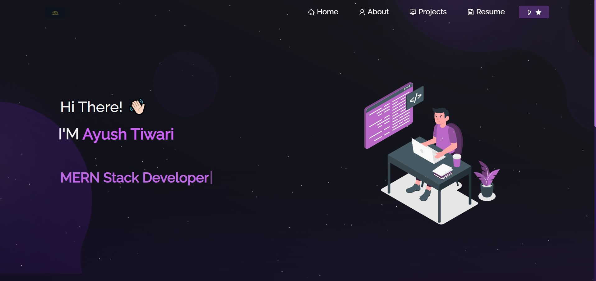

# Portfolio

Welcome to my portfolio! This project showcases my work experience and various coding projects through a modern and interactive timeline. Below is a brief overview of the features and components included in this project.

## Features

- **Interactive Timeline**: Displays work experience in a vertical timeline format.
- **Project Cards**: Each experience includes a project card with a background image, project name, description, and a link to the project's GitHub repository.
- **Skills and Tools**: Displays logos of skills and tools I use.
- **Coding Activity**: Shows my coding activity with a GitHub heat map.

## Stacks

Here are some of the tech Stacks I used, represented by logos:

- 

## Example

Here is a visual representation of my Portfolio:

